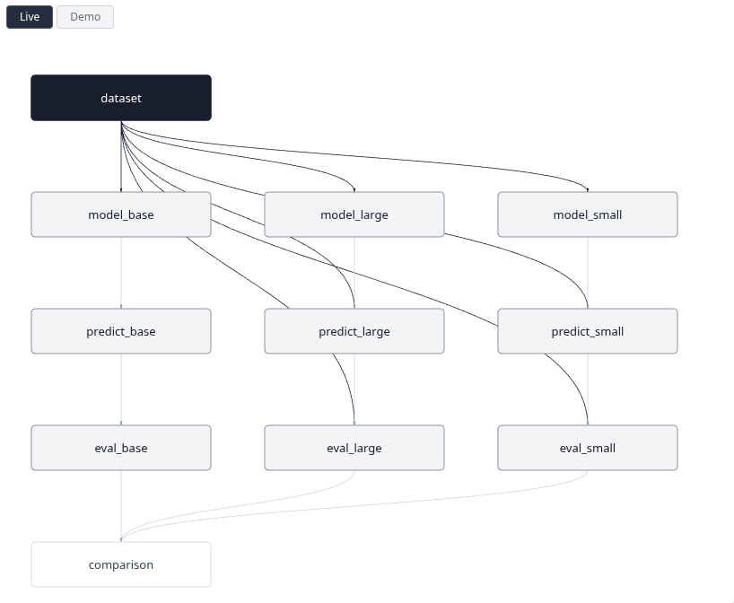

# nix-workflow

A functional-oriented workflow manager that pins exact runtime environments.

### Pinned environments

Each step runs in a pinned environment, so the runtime is fully captured, including exact versions of every tool, across any language. No Docker or extra package managers needed.

### Functional pipeline definition

Steps are functions of their inputs and environment. Each step is addressed by its environment and arguments rather than ad-hoc names like `my-task-result-lr-0.1`, so comparisons and downstream steps are more accurate and more reproducible. Since steps are just configuration, pipelines are declarative, easy to reason about, discover, and reuse.

### Nix language ergonomics

Assign a step to a variable, reference it or its output files via string interpolation, and its full lineage follows automatically:

```nix
dataset = output ''
  ${build_data_bin}/bin/build-data --name=demo --samples=500 --seed=42
'';

model = output ''
  ${train_bin}/bin/train --data=${dataset}/data.csv --epochs=10 --lr=0.001
'';
```

Here `model` depends on `dataset`. `nix-workflow` discovers this from the reference and builds them in the right order, caching any step whose inputs haven't changed.

# Quick start

### Prerequisites

1. Install [Nix](https://nixos.org/download):

```sh
curl -L https://nixos.org/nix/install | sh
```

2. Create the nix-workflow store directory:

```sh
# 1777: world-writable with sticky bit. Any user can create files,
# but only the owner of a file can delete or modify it (same as /tmp).
sudo mkdir -m 1777 -p /nix-workflow
```

### Create a workflow

Create an [`experiment.nix`](example/experiment.nix).
These showcase scripts are mock-ups that take seconds to run and only write data to `/nix-workflow` and `./nix-workflow-output`.

```nix
let
  nw-src = builtins.fetchTarball
    "https://github.com/gzbfgjf2/nix-workflow/archive/main.tar.gz";
  output = (import nw-src).lib.output;

  build_data_bin = import "${nw-src}/example/showcase/build-data" {};
  train_bin = import "${nw-src}/example/showcase/train" {};
  inference_bin = import "${nw-src}/example/showcase/inference" {};
  evaluate_bin = import "${nw-src}/example/showcase/evaluate" {};
  compare_bin = import "${nw-src}/example/showcase/compare" {};
in
rec {
  dataset = output ''
    ${build_data_bin}/bin/build-data --name=demo --samples=500 --seed=42
  '';

  model_small = output ''
    ${train_bin}/bin/train
    --data=${dataset}/data.csv
    --epochs=5 --lr=0.01 --batch-size=128
  '';

  model_base = output ''
    ${train_bin}/bin/train
    --data=${dataset}/data.csv
    --epochs=10 --lr=0.001 --batch-size=32
  '';

  model_large = output ''
    ${train_bin}/bin/train
    --data=${dataset}/data.csv
    --epochs=50 --lr=0.0001 --batch-size=64 --seed=123
  '';

  predict_small = output ''
    ${inference_bin}/bin/inference
    --model=${model_small}/model.json
    --data=${dataset}/data.csv
  '';

  predict_base = output ''
    ${inference_bin}/bin/inference
    --model=${model_base}/model.json
    --data=${dataset}/data.csv
  '';

  predict_large = output ''
    ${inference_bin}/bin/inference
    --model=${model_large}/model.json
    --data=${dataset}/data.csv
  '';

  eval_small = output ''
    ${evaluate_bin}/bin/evaluate
    --predictions=${predict_small}/predictions.csv
    --ground-truth=${dataset}/data.csv
  '';

  eval_base = output ''
    ${evaluate_bin}/bin/evaluate
    --predictions=${predict_base}/predictions.csv
    --ground-truth=${dataset}/data.csv
  '';

  eval_large = output ''
    ${evaluate_bin}/bin/evaluate
    --predictions=${predict_large}/predictions.csv
    --ground-truth=${dataset}/data.csv
  '';

  comparison = output ''
    ${compare_bin}/bin/compare
    --result=${eval_small}
    --result=${eval_base}
    --result=${eval_large}
  '';
}
```

### Run the pipeline

```sh
nix-shell https://github.com/gzbfgjf2/nix-workflow/archive/main.tar.gz \
-A shell --run "nw run experiment.nix"
```

### Visualize

```sh
DAG_DIR=./nix-workflow-output nix-shell \
https://github.com/gzbfgjf2/nix-workflow/archive/main.tar.gz \
-A visual-shell --run nw-visual
```


